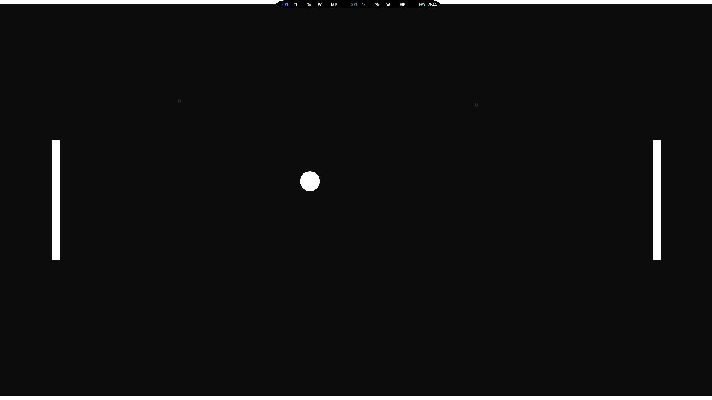

# Pong

A simple but fully playable 2D Pong game built in Unity as part of my game development learning journey.

## Features
- Two-player local multiplayer
- Smooth paddle movement (W/S for left, Up/Down for right)
- Physics-based bouncing ball with momentum
- Ball resets to center after scoring
- Pause menu with ESC key
- Basic score tracking

## How to Play
1. Open the project in Unity
2. Press Play in the editor or build the .exe
3. Use W/S keys for left paddle
4. Use Up/Down arrows for right paddle
5. First player to score wins (basic version)

## Technologies
- Unity 2021.3
- C#
- 2D Physics

## Screenshots

Made while learning Unity and C# for game development. 

GitHub Portfolio: https://github.com/ethan2835/Game-Dev-Portfolio
